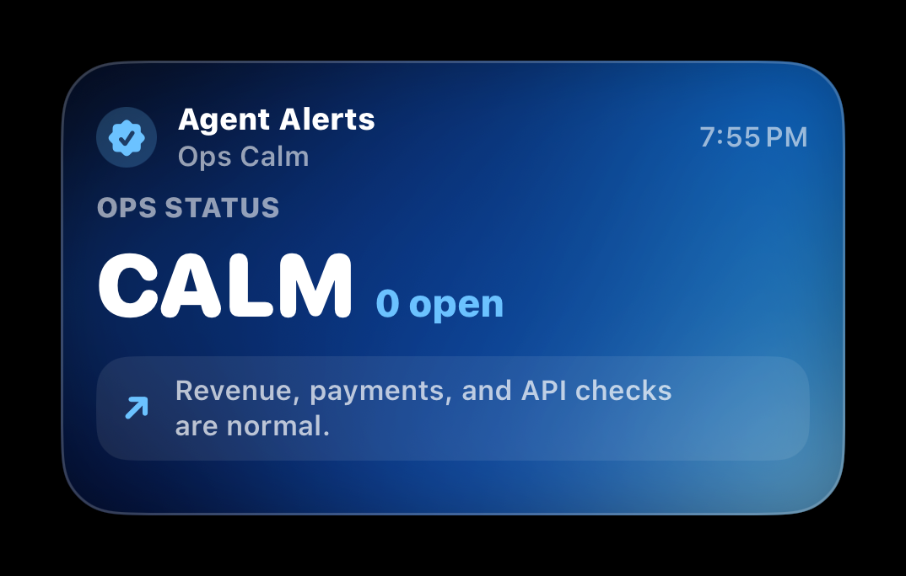
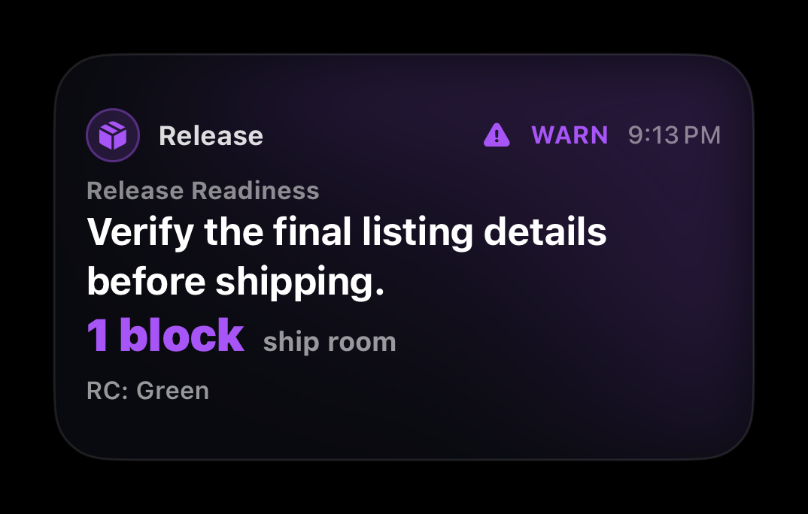
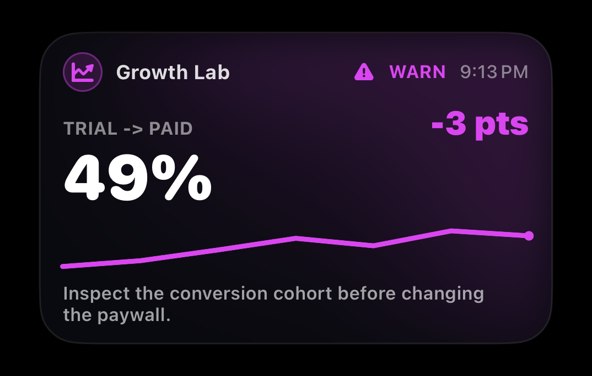
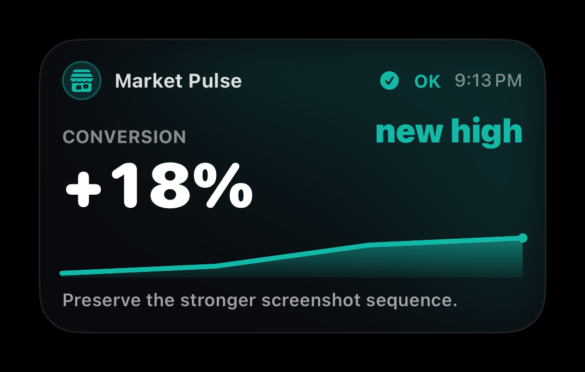
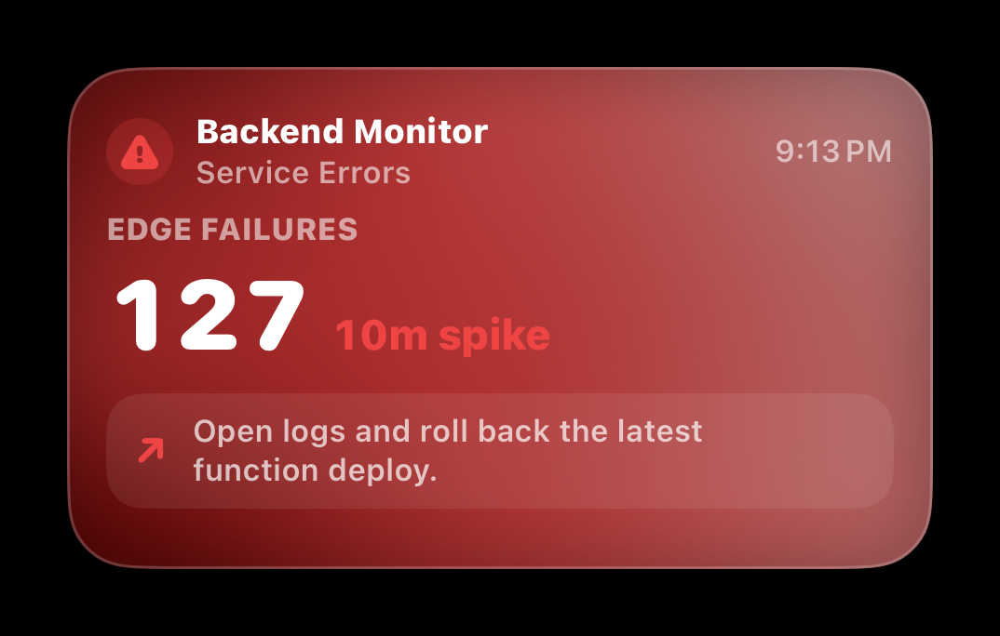
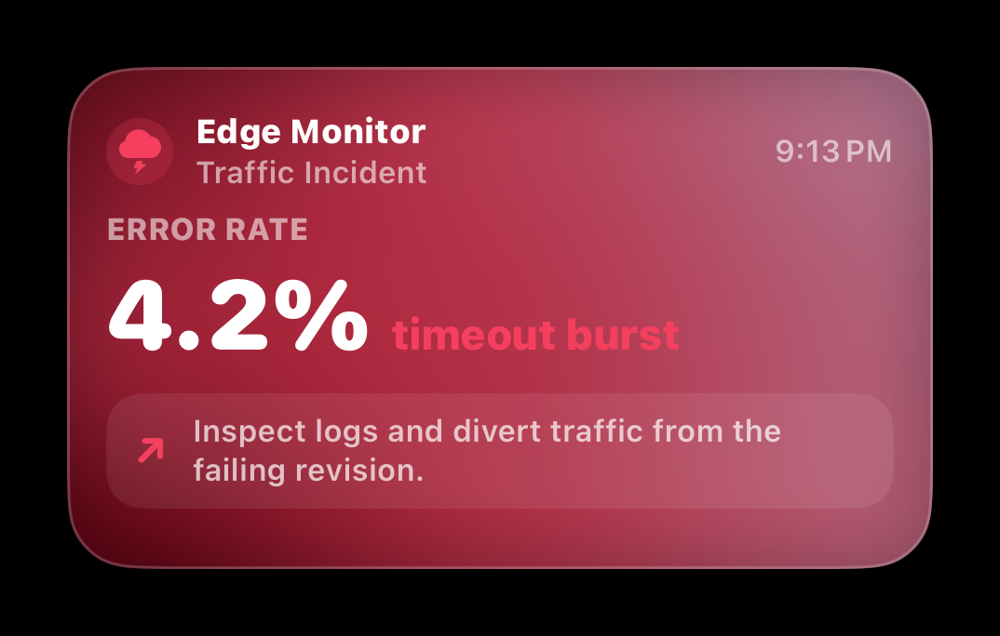
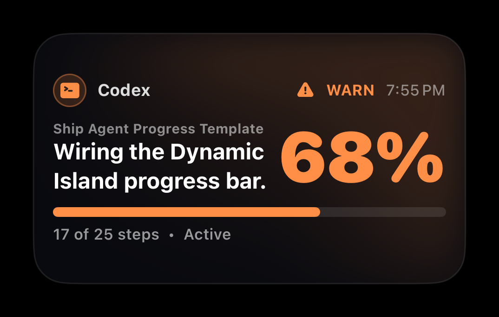
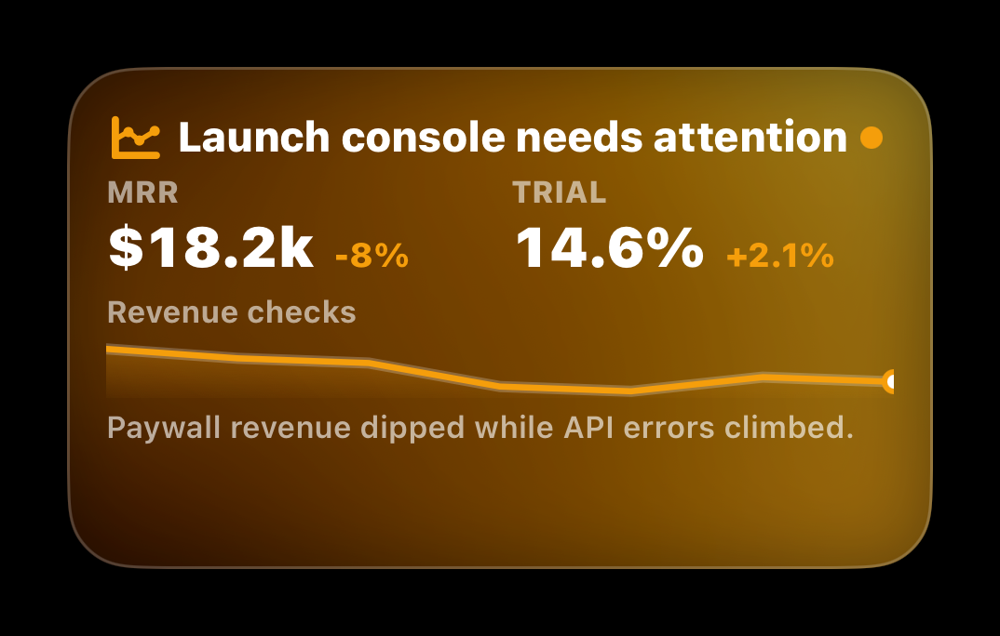
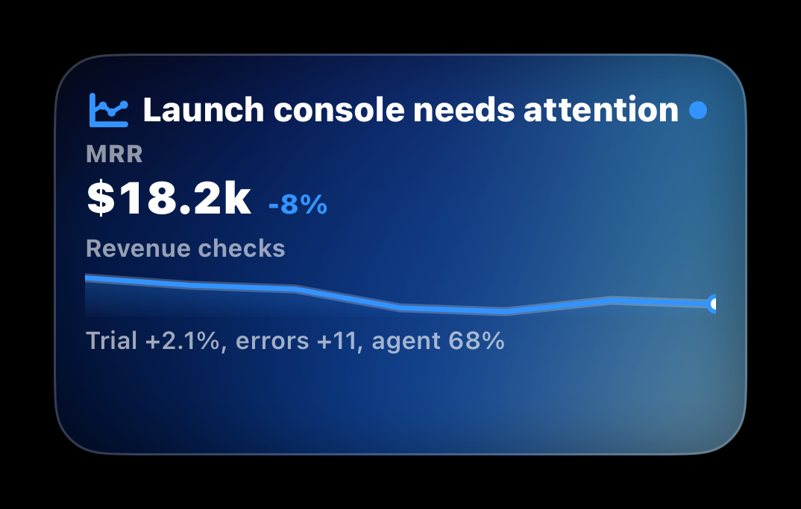

# Agent Alerts Agent Skills

Public agent skills for setting up and running Agent Alerts.

Use the Agent Alerts namespace in public configuration: `agentalerts_send` and
`AGENTALERTS_AGENT_TOKEN`. Start new setups at
[`https://www.andreas.ink/agent`](https://www.andreas.ink/agent).

This repo currently publishes two skills:

- `$agent-alerts-setup`: design an automation and choose its delivery route.
- `$agent-alerts-execution`: evaluate an existing automation and send or skip
  an alert safely.

## Delivery Routes

Use the HTTPS webhook by default for local or hosted Codex, Claude Code,
Cursor, CI, no-code tools, and other runtimes that can make an outbound HTTPS
request. Begin at `https://www.andreas.ink/agent`, complete its connection flow
with Agent Alerts on iPhone, and store the publish token directly in the
runtime's secret manager as `AGENTALERTS_AGENT_TOKEN`. Do not paste it into
agent chat. The bundled helper uses the hosted endpoint by default.

Use the local macOS MCP helper only when the user explicitly wants a
desktop-local integration:

1. Sign into Agent Alerts on iPhone, open the Mac app, and approve the
   discovered Mac from iPhone.
2. Choose the AI app in Agent Alerts for Mac and copy its setup command or
   config.
3. Restart the AI app, check Agent Alerts status, and let the runtime agent call
   `agentalerts_send`.

The legacy `agentalerts` CLI remains an optional compatibility fallback.

Before scheduling Codex or Claude Code, authorize only the exact bundled
`agent-alerts-execution/scripts/send_webhook.sh` command, inject the token
through the runner environment, allow outbound HTTPS to the hosted endpoint,
and complete one interactive smoke test. Do not broadly allow Bash or disable
the runner's permission system.

## Live Activity Examples

| Ops Calm | Release Readiness | Mixpanel Funnel |
| --- | --- | --- |
|  |  |  |

| App Store Analytics | Supabase Errors | GCloud Incident |
| --- | --- | --- |
|  |  |  |

| Codex Agent Progress | Builder Launch Console | Builder Compact Console |
| --- | --- | --- |
|  |  |  |

## Install

Ask an agent to install this skill repo:

```text
Install https://github.com/AndreasInk/AgentAlertsSkill.git so I can set up Agent Alerts automations.
Use $agent-alerts-setup to design or install an automation.
Use $agent-alerts-execution inside the automation when it is time to send or skip.
```

Use `$agent-alerts-setup` for a report, monitor, schedule, CI check, or agent
workflow. Include `$agent-alerts-execution` in the runtime prompt.

## Repo Contents

- `agent-alerts-setup/SKILL.md`
- `agent-alerts-execution/SKILL.md`
- `assets/live-activity-previews/`

## More Info

Read the [Agent Alerts docs](https://andreas.craft.me/qtX8oWJYSSxbJ2), join the
[iOS TestFlight](https://testflight.apple.com/join/KCr6Sxgn), or download the
[latest macOS beta](https://github.com/AndreasInk/ReportKit-Skill/releases/tag/beta).
