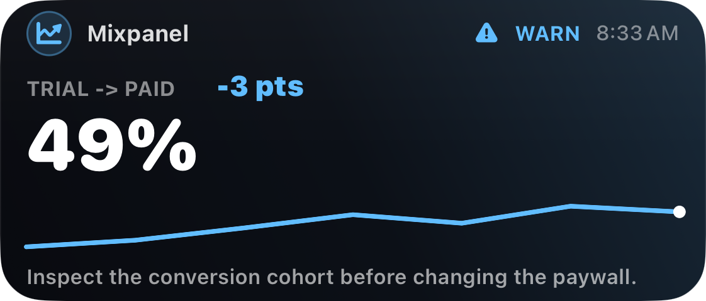
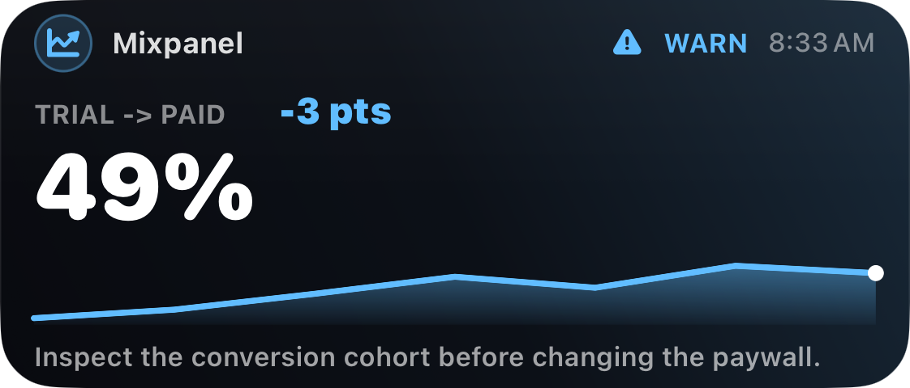
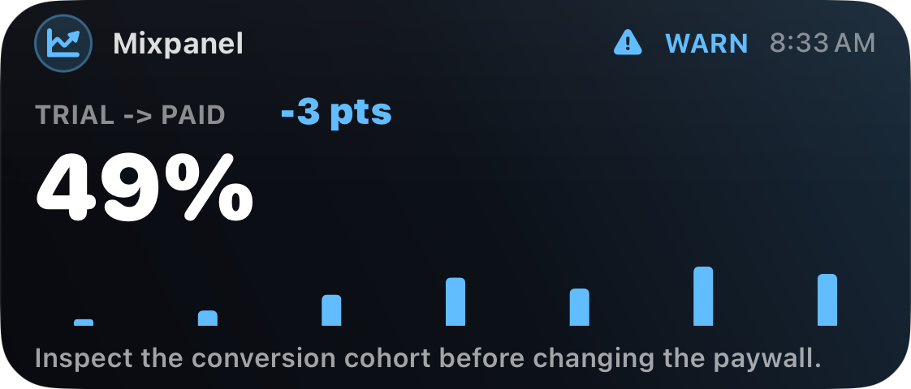
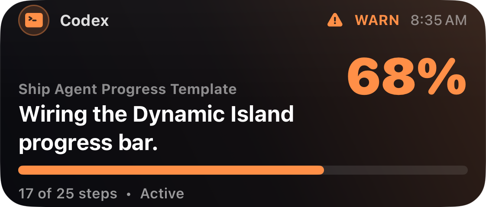
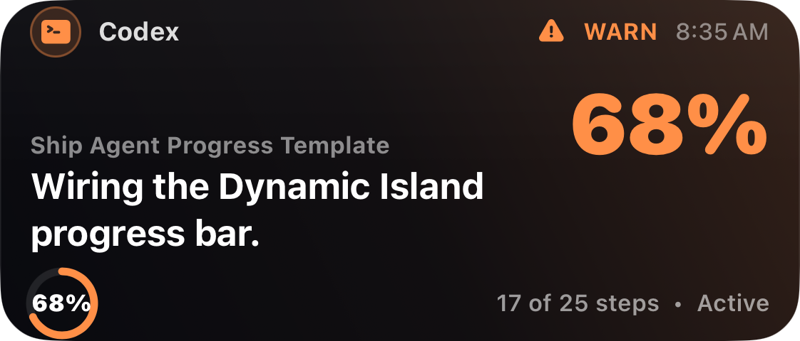
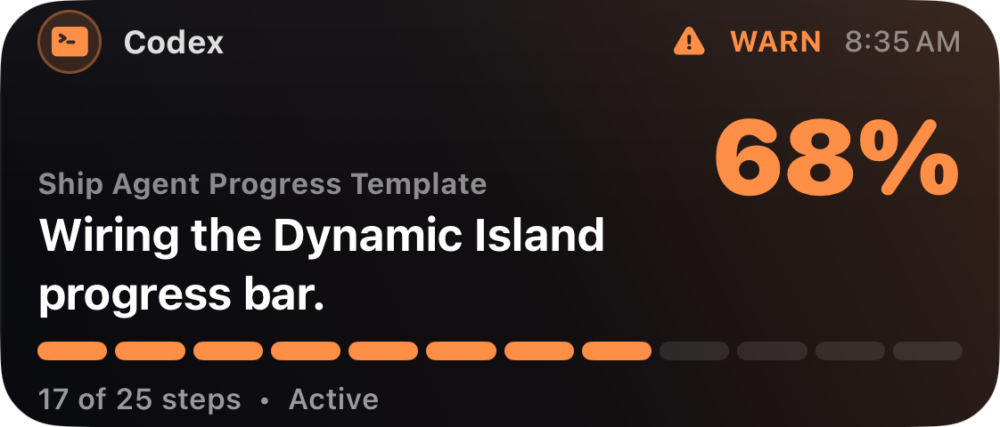
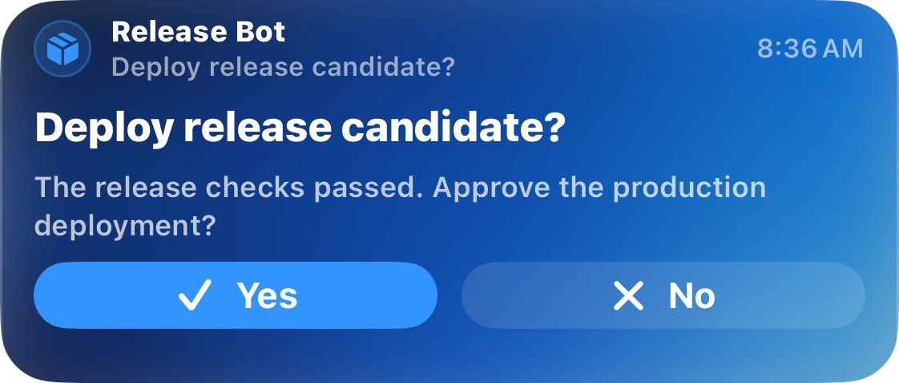

# Live Activity variant catalog

Use this reference when choosing or composing a non-default Live Activity
presentation. The screenshots are native Xcode previews from the current iOS
implementation. Inspect the relevant file under
`assets/live-activity-variants/` with an image-viewing tool when the visual
choice matters; the descriptions below are sufficient for routine unattended
runs.

## Selection map

| Information shape | Variant | Required payload |
| --- | --- | --- |
| Continuous trend | Line chart | `template: growth` + `chart_values` + `chart_style: line` |
| Trend where magnitude matters | Area chart | `template: growth` + `chart_values` + `chart_style: area` |
| Discrete periods or categories | Bar chart | `template: growth` + `chart_values` + `chart_style: bar` |
| General continuous completion | Linear progress | `template: agent` + progress fields + `progress_style: linear` |
| One compact completion number | Ring progress | `template: agent` + progress fields + `progress_style: ring` |
| Finite checklist or step sequence | Segmented progress | `template: agent` + step fields + `progress_style: segmented` |
| Explicit binary decision | Yes / No | `interaction.kind: yes_no` |

Fixed templates have one primary visual family. Do not combine chart and
progress fields and promise that both will render. Choose the information that
must be understood at a glance, express the secondary signal in a metric or
summary, use a validated `builder` layout, or publish a separate activity.

## Chart variants

### Line



Use for direction, rate, or a time series where continuity is the message.
Avoid it for unrelated categories. The final point is emphasized on the
focused metric layout. Omitted `chart_style` defaults to `line`.

### Area



Use when cumulative weight or magnitude under the trend matters in addition to
direction. Avoid it when the filled region could imply a meaningful zero
baseline that the data does not have.

### Bar



Use for discrete periods, buckets, or categories. Keep the series short enough
to remain glanceable; do not encode category labels into metric value fields.

Chart payload example:

```json
{
  "template": "growth",
  "chart_values": [42, 47, 55, 49, 61, 58],
  "chart_title": "Trial to paid",
  "chart_style": "area"
}
```

## Progress variants

### Linear



Use as the neutral default for continuous progress. It gives operation text
the most horizontal room and works well for long-running agents.

### Ring



Use when a single percentage is the primary compact signal. Avoid it when
exact step count matters more than the percent.

### Segmented



Use for finite stages or checklist steps. Supply `completed_steps` and
`total_steps`; do not derive fake steps from an imprecise status estimate.

Progress payload example:

```json
{
  "template": "agent",
  "progress_percent": 68,
  "completed_steps": 17,
  "total_steps": 25,
  "progress_style": "segmented"
}
```

## Direct Yes / No



Use only when the workflow genuinely needs an explicit binary decision. The
buttons appear on supported Lock Screen and Dynamic Island presentations. The
iPhone records the first response; a retryable submission remains queued on
device, while sent, already-recorded, and expired states replace the controls.
Device authentication may be required before a Lock Screen action runs. Treat
this decision card as the primary presentation while it is active rather than
expecting an underlying chart or progress view to remain visible.

Full webhook shape:

```json
{
  "event": "update",
  "activity_id": "release-approval",
  "surfaces": ["live_activity"],
  "payload": {
    "template": "agent",
    "title": "Deploy release candidate?",
    "summary": "All release checks passed.",
    "status": "good"
  },
  "interaction": {
    "kind": "yes_no"
  },
  "idempotency_key": "release-approval-attempt-1"
}
```

An interactive send requires an Agent Alerts token with interaction permission.
Treat pending as no recorded answer, not a negative answer. Keep APNs acceptance,
device-visible delivery, recorded response, and callback acknowledgement as
separate truths.
